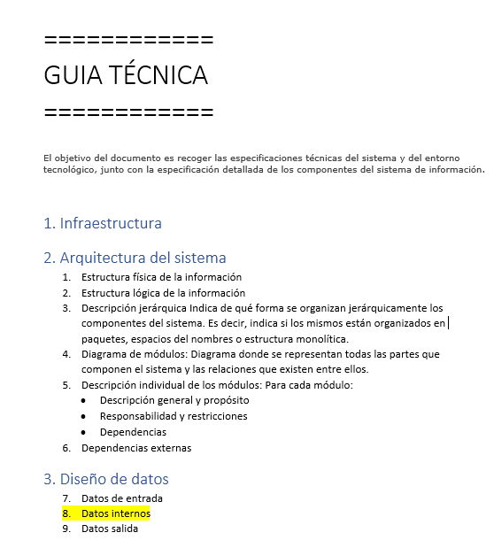

|image0|

=========================
TITULO DEL DOCUMENTO AQUÍ
=========================

|Imagen que contiene interior Descripción generada automáticamente|

========================================= =======================================================================
Fecha: Poner aquí fecha de actualización. Área responsable: Poner aquí nombre del área responsable del documento.
========================================= =======================================================================

`1. PRIMER NIVEL DE TITULO 1: Uso de títulos
2 <#primer-nivel-de-titulo-1-uso-de-títulos>`__

`1.1 Segundo nivel titulo 2 2 <#segundo-nivel-titulo-2>`__

`1.1.1 Tercer nivel 3 2 <#tercer-nivel-3>`__

`1.1.2 Tercer nivel 3 2 <#tercer-nivel-3-1>`__

`1.1.3 Tercer nivel 3: 2 <#tercer-nivel-3-2>`__

`2. PRIMER NIVEL DE TITULO 1: Uso de viñetas
2 <#primer-nivel-de-titulo-1-uso-de-viñetas>`__

`3. PRIMER NIVEL DE TÍTULO 1: Uso de tablas
2 <#primer-nivel-de-título-1-uso-de-tablas>`__

`4. PRIMER NIVEL DE TÍTULO: Introducción de ejemplos
3 <#primer-nivel-de-título-introducción-de-ejemplos>`__

`5. PRIMER NIVEL DE TÍTULO: Introducción de links a webs externas
3 <#primer-nivel-de-título-introducción-de-links-a-webs-externas>`__

`6. PRIMER NIVEL DE TÍTULO: Introducción de imágenes
3 <#primer-nivel-de-título-introducción-de-imágenes>`__

`7. PRIMER NIVEL DE TÍTULO: Introducción de vídeos
3 <#primer-nivel-de-título-introducción-de-vídeos>`__

`8. PRIMER NIVEL DE TÍTULO: Codificación versiones guías.
3 <#primer-nivel-de-título-codificación-versiones-guías.>`__

`9. PRIMER NIVEL DE TÍTULO: Codificación soportes visuales.
5 <#primer-nivel-de-título-codificación-soportes-visuales.>`__

1. PRIMER NIVEL DE TITULO 1: Uso de títulos 
============================================

Texto estándar

1.1 Segundo nivel titulo 2
--------------------------

   Texto estándar

1.1.1 Tercer nivel 3 
~~~~~~~~~~~~~~~~~~~~~

   Texto estándar

.. _tercer-nivel-3-1:

1.1.2 Tercer nivel 3
~~~~~~~~~~~~~~~~~~~~

   Texto estándar

.. _tercer-nivel-3-2:

1.1.3 Tercer nivel 3: 
~~~~~~~~~~~~~~~~~~~~~~

   Texto estándar

2. PRIMER NIVEL DE TITULO 1: Uso de viñetas
===========================================

Aquí viene una explicación de algo

-  Bullet primer nivel: Texto estándar. Definición si se requiere

   -  Bullet segundo nivel: Texto estándar. Definición si se requiere

      -  Bullet tercer nivel: Texto estándar. Definición si se requiere

3. PRIMER NIVEL DE TÍTULO 1: Uso de tablas
==========================================

Texto estándar:

Escribir aquí el nombre del archivo de tabla. (Ver punto 9 de esta
guía).

========= ============ ============
Columna 1    Columna 2    Columna 3
========= ============ ============
Texto        Texto        Texto
\                     
\                     
\                     
\                     
========= ============ ============

.. _section-1:

.. _section-2:

4. PRIMER NIVEL DE TÍTULO: Introducción de ejemplos 
====================================================

   Ejemplo:

.. code-block:: json

   Escribir ejemplo aquí

5. PRIMER NIVEL DE TÍTULO: Introducción de links a webs externas
================================================================

   Introducir link aquí

   https://grupotelepizzauniversity.telepizza.com

6. PRIMER NIVEL DE TÍTULO: Introducción de imágenes
===================================================

Escribir aquí el nombre del archivo de la imagen. (Ver punto 9 de esta
guía).

|image2|

7. PRIMER NIVEL DE TÍTULO: Introducción de vídeos
=================================================

**ESCRIBIR AQUÍ TÍTULO DEL VÍDEO. (REFERENCIA DE CONTENIDO PARA EL
USUARIO).**

Escribir aquí el nombre del archivo del vídeo. (Ver punto 9 de esta
guía).

8. PRIMER NIVEL DE TÍTULO: Codificación versiones guías.
========================================================

Para poder mantener la documentación actualizada y poder realizar un
seguimiento de las versiones se subirán las guías técnicas, funcionales
y de configuración (que habrán seguido las pautas de esta plantilla) en
la carpeta de cada línea.

Se deberán crear tres carpetas dentro de la propia línea con el nombre
de los tipos de guía.

|image3| `PULSA AQUÍ PARA ACCEDER A
TEAMS <https://teams.microsoft.com/_#/files/General?threadId=19%3A0a33ef7156d643578c4ec542aa082504%40thread.skype&ctx=channel&context=CROSS%252FAcademy%252FDocumentacion%2520de%2520Gestion%252FRepositorio%2520Documental>`__

Se nombrarán de la siguiente manera:

   XXXXXZZ YYYYMMDD

XXXXX: Codificación línea.

ZZ: Codificación guía.

YYYYMMDD: Fecha de documento

Codificación según línea:

========================= ===============
Línea                        Nomenclatura
========================= ===============
Línea Billing                BILLI
Línea Data Warehouse         WARE
Línea Data Lake              LAKE
Línea MDM                    MDM
Línea Infraestructura        INFRA
Línea API                    API
Línea Store                  STORE
Línea eCommerce              ECOMM
Línea Panel de Control       PANEL
Línea Interfaz People        IPEOP
Línea Interfaz Financiera    IFINA
Línea Seguridad              SEGUR
========================= ===============

Codificación según guía:

===================== ===============
Guia                     Nomenclatura
===================== ===============
Guia técnica             GT
Guia funcional           GF
Guia de configuración    GC
===================== ===============

..

   Ejemplo:

.. code-block:: json

   BILLIGF20190723

9. PRIMER NIVEL DE TÍTULO: Codificación soportes visuales.
==========================================================

Para poder manejar ordenadamente los recursos visuales de las guías e
incluirlas con la mejor calidad posible, se estable el siguiente
procedimiento:

Se incluirán en Word las imágenes y las tablas. Estas, junto con los
vídeos, deben ir guardados en una carpeta creada en Teams **dentro de
cada una de las líneas con el nombre de “Soportes visuales”**:

|image4| `PULSA AQUÍ PARA ACCEDER A
TEAMS <https://teams.microsoft.com/_#/files/General?threadId=19%3A0a33ef7156d643578c4ec542aa082504%40thread.skype&ctx=channel&context=CROSS%252FAcademy%252FDocumentacion%2520de%2520Gestion%252FRepositorio%2520Documental>`__

Se nombrarán de la siguiente manera:

   XXXXXZZN.MM.PPT001

XXXXX: Codificación línea.

ZZ: Codificación guía.

N.MM.PP: Versión

T: Tipo de archivo.

001: numeración de archivo correlativo por orden de aparición en
documento.

Codificación según línea:

========================= ===============
Línea                        Nomenclatura
========================= ===============
Línea Billing                BILLI
Línea Data Warehouse         WARE
Línea Data Lake              LAKE
Línea MDM                    MDM
Línea Infraestructura        INFRA
Línea API                    API
Línea Store                  STORE
Línea eCommerce              ECOMM
Línea Panel de Control       PANEL
Línea Interfaz People        IPEOP
Línea Interfaz Financiera    IFINA
Línea Seguridad              SEGUR
========================= ===============

Codificación según guía:

===================== ===============
Guia                     Nomenclatura
===================== ===============
Guia técnica             GT
Guia funcional           GF
Guia de configuración    GC
===================== ===============

Codificación según versión:

====================== ===============
Guia                      Nomenclatura
====================== ===============
Capítulo del documento    N
Subtítulo                 MM
Número versión            PP
====================== ===============

Codificación según tipo de archivo:

====== ===============
Guia      Nomenclatura
====== ===============
Imagen    I
Tabla     T
Vídeo     V
====== ===============

..

   Ejemplo:

|image5|

.. code-block:: json

   La nomenclatura de una imagen que corresponde a datos internos de una
   guía técnica de la línea de Billing será:

   BILLIGT3.08.01.I001

.. |image0| image:: media/image1.png
   :width: 2.11806in
   :height: 0.99586in
.. |Imagen que contiene interior Descripción generada automáticamente| image:: media/image2.PNG
   :width: 6.49024in
   :height: 1.31944in
.. |image2| image:: media/image3.jpg
   :width: 6.22778in
   :height: 2.40278in
.. |image3| image:: media/image4.png
   :width: 0.44792in
   :height: 0.36458in
.. |image4| image:: media/image4.png
   :width: 0.44792in
   :height: 0.36458in

